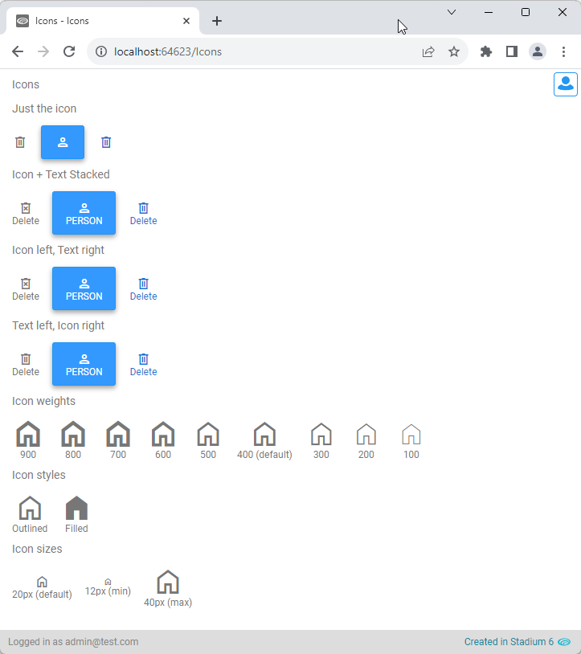
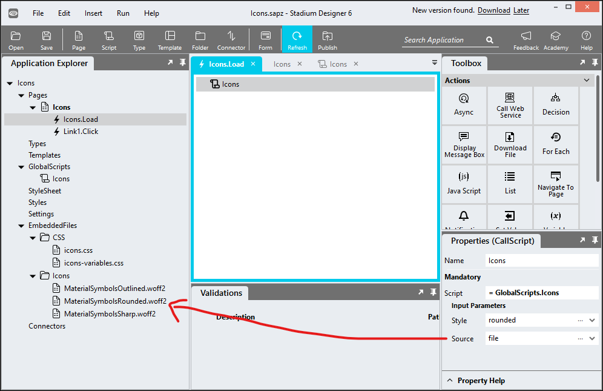

# Icons

## Description

This repo enables you to use the over 3800 glyphs strong [Material Design Symbols](https://fonts.google.com/icons) icons library from Google in your Stadium applications. 

The 'Icons' script includes the Google Symbols library in pages and provides support for 'Label', 'Button' and 'Link' controls. 

In order to display icons in DataGrids, it is necessary to additionally use the [DataGrid Icons](https://github.com/stadium-software/datagrid-icons) repo.

## Examples


## Version
1.0

## Global Script Setup
Add this script to include the Google Symbols library in your page

1. Create a Global Script called "Icons"
2. Add the following input parameters to the Global Script
   1. Source
   2. Style
3. Drag a *JavaScript* action into the script
4. Add the Javascript below into the JavaScript code property
```javascript
/* Stadium Script Version 1.0 */
let iconStyle = ~.Parameters.Input.Style;
let source = ~.Parameters.Input.Source;
let head = document.getElementsByTagName("head")[0];
let styleTag = document.getElementById("icon-classes");
if (!styleTag) {
    styleTag = document.createElement("style");
    styleTag.id = "icon-classes";
    styleTag.type = "text/css";
    head.appendChild(styleTag);
}
if (iconStyle) {
    iconStyle = iconStyle.toLowerCase();
    if (iconStyle != "rounded" && iconStyle != "sharp") {
        iconStyle = "outlined";
    }
} else { 
    iconStyle = "outlined";
}
if (source) {
    source = source.toLowerCase();
    if (source == "file") {
        appendFileRefs();
    } else if (source.startsWith("http")) {
        appendSelfHosted();
    } else {
    appendLink();
}
} else {
    appendLink();
}
setFontClass();
initIcons();

function initIcons() {
    let iconContainers = document.querySelectorAll('[class^="icon-symbol-"], [class*=" icon-symbol-"]');
    for (let i = 0; i < iconContainers.length; i++) {
        let iconContainer = iconContainers[i];
        let arrClasses = iconContainer.getAttribute("class").split(" ");
        let iconStyleClass = "material-symbols-" + iconStyle;
        let symbolClass = arrClasses.find((cl) => cl.startsWith("icon-symbol-"));
        if (arrClasses.includes("button-container")) {
            let txt = document.createElement("span");
            txt.textContent = iconContainer.textContent;
            iconContainer = iconContainer.querySelector("button");
            iconContainer.textContent = "";
            iconContainer.appendChild(txt);
        } else if (arrClasses.includes("link-container")) {
            let txt = document.createElement("span");
            txt.textContent = iconContainer.textContent;
            iconContainer = iconContainer.querySelector("a");
            iconContainer.textContent = "";
            iconContainer.appendChild(txt);
        } else if (arrClasses.includes("label-container")) {
            let txt = document.createElement("span");
            txt.textContent = iconContainer.textContent;
            iconContainer = iconContainer.querySelector("span");
            iconContainer.textContent = "";
            iconContainer.appendChild(txt);
        }
        if (styleTag.innerHTML.indexOf(symbolClass) == -1) {
            styleTag.innerHTML += "." + symbolClass + " i:before { content: '" + symbolClass.replace("icon-symbol-", "").replace("-", "_") + "'; }";
        }
        let iconSize = arrClasses.find((cl) => cl.startsWith("icon-size-"));
        let iSize = "";
        if (iconSize) iSize = '.icon-size-' + iconSize.replace("icon-size-", "") + ' [class^="material-symbols-"],.icon-size-' + iconSize.replace("icon-size-", "") + ' [class*=" material-symbols-"] {font-size: ' + iconSize.replace("icon-size-", "") + 'px;}';
        if (styleTag.innerHTML.indexOf(iSize) == -1) {
            styleTag.innerHTML += iSize;
        }
        let icon = document.createElement("i");
        icon.classList.add(iconStyleClass);
        iconContainer.appendChild(icon);
    }
}

function setFontClass() {
    if (iconStyle == "rounded") {
        styleTag.innerHTML += ".material-symbols-rounded {font-family: 'Material Symbols Rounded';}";
    } else if (iconStyle == "sharp") {
        styleTag.innerHTML += ".material-symbols-sharp {font-family: 'Material Symbols Sharp';}";
    } else { 
        styleTag.innerHTML += ".material-symbols-outlined {font-family: 'Material Symbols Outlined';}";
    }
}
function appendLink() {
    let link = document.createElement("link");
    link.rel = "stylesheet";
    if (iconStyle == "rounded") {
        let styleSheet = document.querySelectorAll("[href^='https://fonts.googleapis.com/css2?family=Material+Symbols+Rounded']");
        if (styleSheet.length == 0) {
            link.href = "https://fonts.googleapis.com/css2?family=Material+Symbols+Rounded:opsz,wght,FILL,GRAD@20..48,100..700,0..1,-50..200&display=block";
        }
    } else if (iconStyle == "sharp") {
        let styleSheet = document.querySelectorAll("[href^='https://fonts.googleapis.com/css2?family=Material+Symbols+Sharp']");
        if (styleSheet.length == 0) {
            link.href = "https://fonts.googleapis.com/css2?family=Material+Symbols+Sharp:opsz,wght,FILL,GRAD@20..48,100..700,0..1,-50..200&display=block";
        }
    } else { 
        let styleSheet = document.querySelectorAll("[href^='https://fonts.googleapis.com/css2?family=Material+Symbols+Outlined']");
        if (styleSheet.length == 0) {
            link.href = "https://fonts.googleapis.com/css2?family=Material+Symbols+Outlined:opsz,wght,FILL,GRAD@20..48,100..700,0..1,-50..200&display=block";
        }
    }
    head.appendChild(link);
}
function appendFileRefs() {
    if (iconStyle == "rounded") {
        styleTag.innerHTML += "@font-face {font-family: 'Material Symbols Rounded';font-style: normal;src: url(EmbeddedFiles/Icons/MaterialSymbolsRounded.woff2) format('woff2');font-display: block;}";
    } else if (iconStyle == "sharp") {
        styleTag.innerHTML += "@font-face {font-family: 'Material Symbols Sharp';font-style: normal;src: url(EmbeddedFiles/Icons/MaterialSymbolsSharp.woff2) format('woff2');font-display: block;}";
    } else { 
        styleTag.innerHTML += "@font-face {font-family: 'Material Symbols Outlined';font-style: normal;src: url(EmbeddedFiles/Icons/MaterialSymbolsOutlined.woff2) format('woff2');font-display: block;}";
    }
}
function appendSelfHosted() { 
    styleTag.innerHTML += "@font-face {font-family: 'Material Symbols " + iconStyle + "';font-style: normal;src: url(" + source + ") format('woff2');}";
}
```

## Page.Load Setup and Icon Display

**Simplest**

1. Drag the Global Script called "Icons" into the Page.Load event handler
2. Drag a *Label* control into the page
3. Find a symbol you want to display in the [Material Design Symbols](https://fonts.google.com/icons) library
4. Note the name of the symbol in that library (e.g. 'Delete Forever' or 'Home')
5. Create a class name by replacing spaces with dashes (-) and appending the symbol name to "icon-symbol-" in lowercase letters
6. Add the class to the control and preview the page

*Examples*
```
icon-symbol-home
```
```
icon-symbol-check-circle
```
```
icon-symbol-delete-forever
```

**Icon Styles**

Adding specific classes to the control allows for styling icons in a few ways
1. Positioning
   1. By default the icons are shown above the control text
   2. *icon-left*: places the icon to the left of the text in the control
   3. *icon-right*: places the icon to the left of the text in the control
2. Weight
   1. By default icons are shown with a regular weight (400)
   2. *icon-weight-xxx* causes icons to show with the weights specified (e.g. *icon-weight-600*). CSS accepts weights in increments of 100. *icon-weight-900* is the max and *icon-weight-100* the minimum allowed value
3. Size
   1. Default icon size is 20px
   2. *icon-size-xx* allows you to define a custom the icon size in pixels (e.g. icon-size-12 or icon-size-40)
4. Filled
   1. By default icons are shown outlined
   2. Adding *icon-fill* causes an icon to show filled

*Examples*
```
icon-symbol-home icon-weight-800 icon-size-40 icon-fill
```
```
icon-symbol-delete-forever icon-weight-200 icon-size-24
```

## Optional Icon Script Input Parameters
You can optionally enter values in the two input parameter fields
1. Source
   1. Empty: Leaving this parameter empty will cause the script to attach links in the page header to the google fonts icon library. **This is the recommended implementation**
   2. file: The woff2 font files can be added to a folder called "Icons" in the EmbeddedFiles. In this case this parameter needs to be set to "file". You can find the icon files in the [fonts](fonts/) folder in this repo. 
   *Warning*: Saving the Stadium application slowed does significantly when I included these files in my EmbeddedFiles folder
   3. You can also self-host the font files. In this case a URL that points to the woff2 font file must be supplied. 
   *Warning:* Linking to external files can cause CORS issues and can be tricky to set up
2. Style
   1. Empty: Leaving this parameter empty will cause the script to use an icon set called "Outlined" [Outlined Icons](https://fonts.google.com/icons?icon.style=Outlined) set
   2. rounded: To use the [Rounded Icons](https://fonts.google.com/icons?icon.style=Rounded) set
   3. sharp: To use the [Sharp Icons](https://fonts.google.com/icons?icon.style=Sharp) set

*Included font files example*


## Customising CSS
1. Open the CSS file called [*icons-variables.css*](icons-variables.css) from this repo
2. Adjust the variables in the *:root* element as you see fit

## Applying the CSS

**Stadium 6.6 or higher**
1. Create a folder called *CSS* inside of your Embedded Files in your application
2. Drag the two CSS files from this repo [*icons-variables.css*](icons-variables.css) and [*icons.css*](icons.css) into that folder
3. Paste the link tags below into the *head* property of your application
```html
<link rel="stylesheet" href="{EmbeddedFiles}/CSS/icons.css">
<link rel="stylesheet" href="{EmbeddedFiles}/CSS/icons-variables.css">
``` 

**Versions lower than 6.6**
1. Copy the CSS from the two css files into the Stylesheet in your application

## CSS Upgrading
To upgrade the CSS in this module, follow the [steps outlined in this repo](https://github.com/stadium-software/samples-upgrading)
