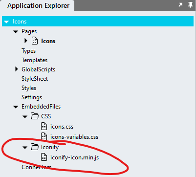
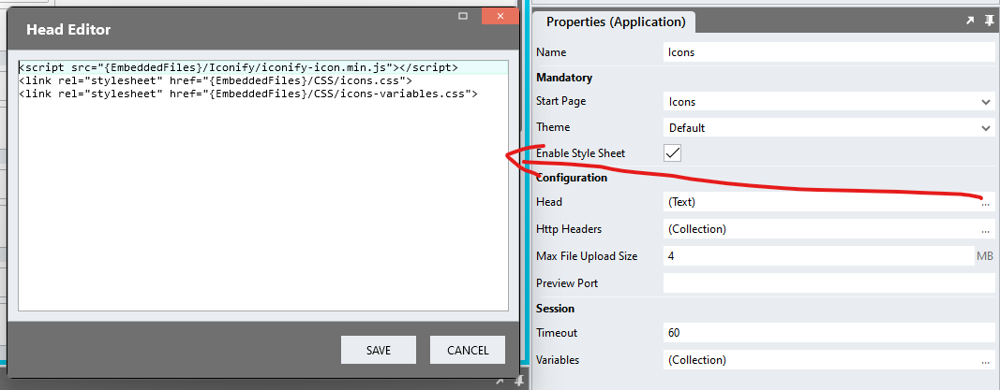
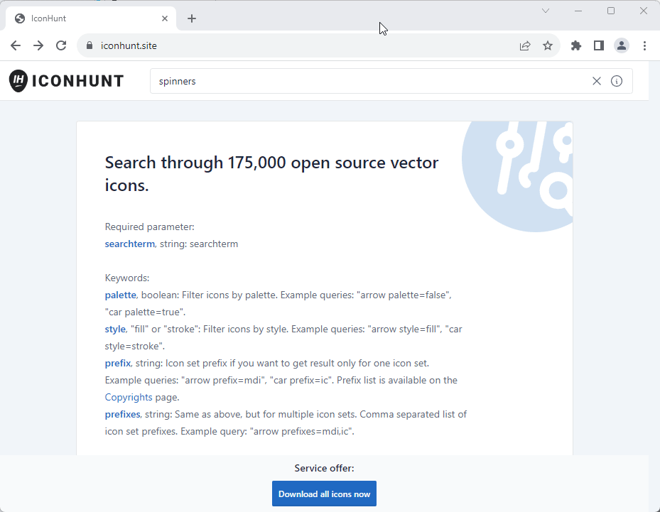

# Icons

## Description

This repo uses the [Iconify](https://icon-sets.iconify.design/) framework to enable the use of a large number of icons from a variety of sets in Stadium 6 applications. A variety of modules depend on the implementation of this library before icons will show. 

## Note
The Icons module requires application users to have an internet connection. This module does not currently support offline environments. Offline installations are, in principle, possible, but may be complex to implement from an infrastructural perspective. 

## Version
1.0 initial

1.1 added support for utils library

## Application Setup
1. Check the *Enable Style Sheet* checkbox in the application properties

## Framework Setup
1. Create a folder called "Iconify" inside of your Embedded Files in your application
2. Drag the JS file from the framework folder of this repo [*iconify-icon.min.js*](framework/iconify-icon.min.js?raw=true) into that folder



3. Paste the link tag below into the *head* property of your application
```html
<script src="{EmbeddedFiles}/Iconify/iconify-icon.min.js"></script>
``` 



## Global Script Setup
Add this script to include the Google Symbols library in your page

1. Create a Global Script called "Icons"
2. Add the following input parameter to the Global Script
   1. ParentClass
3. Drag a *JavaScript* action into the script
4. Add the Javascript below into the JavaScript code property
```javascript
/* Stadium Script Version 1.1 https://github.com/stadium-software/icons */
let initIcons = async () => {
    let parentClassName = ~.Parameters.Input.ParentClass;
    let parent = document.documentElement;
    if (parentClassName) { 
        parent = document.querySelector("." + parentClassName);
    }
    let iconifyScript = document.querySelector("script[src*='iconify-icon.min.js']");
    if (!iconifyScript) {
        console.error("The header element must contain a link to the 'iconify-icon.min.js' file");
        return false;
    }
    let iconContainers = parent.querySelectorAll('.stadium-icon');
    for (let i = 0; i < iconContainers.length; i++) {
        let iconContainer = iconContainers[i];
        let classes = iconContainer.getAttribute("class");
        if (classes) classes = classes.toLowerCase();
        let arrClasses = classes.split(" ");
        let children = iconContainer.childNodes;
        if (children.length == 0) {
            continue;
        }

        let iSize = arrClasses.find((cl) => cl.startsWith("icon-size-"));
        let iconSize = "24";
        if (iSize) {
            iconSize = iSize.replace("icon-size-", "");
        }

        let iColor = arrClasses.find((cl) => cl.startsWith("icon-color-"));
        let iconStyles = "";
        if (iColor) {
            iColor = iColor.replace("icon-color-", "");
            if (/^#[0-9A-F]{6}$/i.test('#' + iColor)) { 
                iColor = '#' + iColor;
            }
            iconStyles = "color: " + iColor + ";";
        }

        let iconSymbol = arrClasses.find((cl) => cl.indexOf(":") > 0);
        if (iconSymbol && iconSymbol.indexOf("utils-") == -1) {
            let icon = document.createElement("iconify-icon");
            icon.setAttribute("icon", iconSymbol);
            icon.setAttribute("style", iconStyles);
            icon.setAttribute("width", iconSize);
            icon.setAttribute("height", iconSize);

            let iconContainerContent = iconContainer.children[0];
            if (iconContainerContent) {
                let txt = document.createElement("span");
                txt.textContent = iconContainerContent.textContent;
                iconContainerContent.textContent = "";
                iconContainerContent.appendChild(txt);
                iconContainerContent.appendChild(icon);
            } else { 
                iconContainer.appendChild(icon);
            }
        }
    }
};
initIcons();
```

## Finding an Icon

1. Find the symbol you want to use in the [Iconify Icons](https://icon-sets.iconify.design/) library
2. Copy the name of the symbol in that library (e.g. 'material-symbols:wifi-sharp' or 'material-symbols:undo')


## Alternative Library
The [IconHunt](https://www.iconhunt.site/) website also supports the same open Source Vector libraries



## Styling

Styling defined in the icons-variables.css CSS file applies defaults for all icons. In most implementations, these can be overridden. See the [control-specific icons repo](https://github.com/stadium-software/modules?tab=readme-ov-file#icons) for more information. 

## Icon Style Classes
Repos that support the Icons module may support the use of additional classes to controls to manipulate the icon

1. Positioning
   1. By default the icons are shown above the control text where such text exists. This can also be achieved by adding the class *icon-top*
   2. *icon-left*: places the icon to the left of the text in the control
   3. *icon-right*: places the icon to the left of the text in the control
   4. *icon-bottom*: places the icon under the text
2. Size
   1. The default icon size is 24px x 24px
   2. *icon-size-xx* allows you to define a custom icon size in pixels (e.g. icon-size-12 for 12px by 12px or icon-size-40 for 40px by 40px)
3. Color
   1. The default icon color is inherited by the page
   2. *icon-color-######* allows you to define a custom icon color in hex (e.g. icon-color-#FFFF00, icon-color-ccc or icon-color-red)

## Customising CSS
1. Open the CSS file called [*icons-variables.css*](icons-variables.css) from this repo
2. Adjust the variable in the *:root* element to amend the default color and size of all icons. You can always override these by adding specific classes as explained above

## Applying the CSS
The CSS below is required for the correct functioning of the module. Some elements can be [customised](#customising-css) using a variables CSS file.

**Stadium 6.6 or higher**
1. Create a folder called *CSS* inside of your Embedded Files in your application
2. Drag the two CSS files from this repo [*icons-variables.css*](icons-variables.css) and [*icons.css*](icons.css) into that folder
3. Paste the link tags below into the *head* property of your application
```html
<link rel="stylesheet" href="{EmbeddedFiles}/CSS/icons.css">
<link rel="stylesheet" href="{EmbeddedFiles}/CSS/icons-variables.css">
``` 

**Versions lower than 6.6**
1. Copy the CSS from the two css files into the Stylesheet in your application

## CSS Upgrading
To upgrade the CSS in this module, follow the [steps outlined in this repo](https://github.com/stadium-software/samples-upgrading)

# Application Publishing
1. Publish the application
2. Open the Stadium Application Manager (SAM)
3. Find the application and select *Configure*
4. Select the *Configuration* menu item
5. In the *HTTP Response Headers* table, edit the *Content-Security-Policy*
   1. Copy the string below into the *Content-Security-Policy* property 

   OR 

   2. Add a link to *https://api.iconify.design* to *connect-src 'self'* section
```
default-src 'self'; img-src 'self' data: https:; script-src 'self' 'unsafe-eval' https://code.jquery.com https://cdnjs.cloudflare.com; style-src 'self' 'unsafe-inline' https://cdnjs.cloudflare.com; font-src 'self' https://cdnjs.cloudflare.com http://localhost:8888/stadiumapplications/icons/material-design-webfontkit-variable-fonts/; connect-src 'self' https://*.okta.com https://*.auth0.com https://accounts.google.com https://www.googleapis.com/oauth2/v3/certs https://openidconnect.googleapis.com/v1/userinfo https://login.microsoftonline.com https://graph.microsoft.com https://api.iconify.design;
```