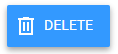

# Icons

Icons can be displayed in Stadium 6 by adding some simple CSS to the application StyleSheet. 

## Steps

1. Check the *Enable Style Sheet* checkbox in the application properties
2. Add a class to the control (e.g. `my-icon`)
3. Identify the element that contains the icon inside the rendered control (e.g. a `<button>` or `<a>` element). This requires you to inspect the control in the browser developer tools
4. Add a selector to the StyleSheet to target the icon element. For example, if the icon is inside a `<button>` element, you would use `.my-icon button`
6. Find the icon you want to use in the [Icones](https://icones.js.org/) library. Adjust the icon colour to one matching your theme and copy the "Data Url" of the icon.
5. Add the following CSS to the StyleSheet:
```CSS
background-repeat: no-repeat;
background-size: <height and width of the icon>;
background-image: url("<the DATA URL for the icon>");
background-position: <position of the icon in the button>;
```

## Notes

1. Since this method displays the icon as a background image, the image size will not affect the width of height of the element. Add height and width attributes to the CSS above if necessary. 
2. To place an icon next to text, add some padding to the control. For example, if the icon is on the left side of the text, you can add `padding-left: 30px;` to the control.

## Example

This example displays a button with a Trashbin icon on the left side of the button text

```CSS
.my-icon .btn-default {
    height: auto;
    width: auto;
    background-repeat: no-repeat;
    background-size: 24px;
    background-image: url("data:image/svg+xml,%3Csvg xmlns='http://www.w3.org/2000/svg' width='1em' height='1em' viewBox='0 0 24 24'%3E%3C!-- Icon from Material Symbols by Google - https://github.com/google/material-design-icons/blob/master/LICENSE --%3E%3Cpath fill='%23ffffff' d='M5 21V6H4V4h5V3h6v1h5v2h-1v15zm2-2h10V6H7zm2-2h2V8H9zm4 0h2V8h-2zM7 6v13z'/%3E%3C/svg%3E");
    background-position: center left 6px;
    padding-left: 36px;
}
```

